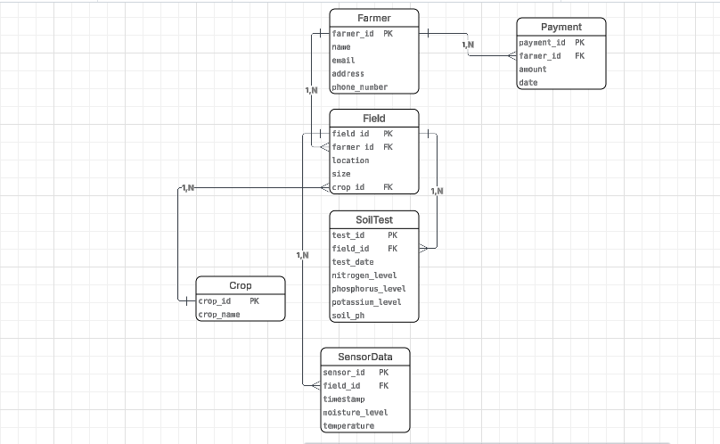

# Smart Fertilizer Recommendation System

**Category:** Agriculture  
**Student Name:** Isimbi Mushimire Iris  
**Student ID:** 27121

---

## Table of Contents
- [Project Overview](#project-overview)
- [Problem Statement](#problem-statement)
- [Key Objectives](#key-objectives)
- [Innovation & Improvements](#innovation--improvements)
- [Repository Structure](#repository-structure)
- [Quick Start Instructions](#quick-start-instructions)
- [Documentation](#documentation)
- [Screenshots](#screenshots)
- [Database Objects](#database-objects)
- [Business Intelligence](#business-intelligence)

---

## Project Overview

The **Smart Fertilizer Recommendation System** is a comprehensive **PL/SQL-based application** designed to help farmers make informed, data-driven decisions about fertilizer use. The system analyzes soil nutrient content focusing on three essential macronutrients for crop growth:

- **Nitrogen (N)** - Essential for leaf and stem growth
- **Phosphorus (P)** - Critical for root development and flowering
- **Potassium (K)** - Important for overall plant health and disease resistance

This intelligent system provides automated fertilizer recommendations based on real-time soil test results, eliminating guesswork and optimizing agricultural productivity.

### Key Features:
- Automated soil nutrient analysis
- Real-time fertilizer recommendations
- Audit logging for all operations
- Analytics and reporting capabilities
- Scalable architecture for future enhancements

---

## Problem Statement

Farmers face significant challenges in determining the correct fertilizer type and amount for their crops. Incorrect fertilization leads to reduced crop yields, wasted resources, increased costs, and environmental damage from soil nutrient imbalances. This system addresses these challenges by automating fertilizer recommendations based on scientific soil analysis, ensuring optimal crop productivity while minimizing waste and environmental impact.

---

## Key Objectives

1. **Analyze Soil Composition:** Evaluate soil nutrient content (N, P, K) based on laboratory test results
2. **Provide Intelligent Recommendations:** Generate precise fertilizer suggestions tailored to soil conditions
3. **Automate Decision-Making:** Eliminate manual calculations and reduce human error
4. **Optimize Resource Usage:** Minimize fertilizer waste and reduce agricultural costs
5. **Enable Data-Driven Insights:** Provide analytics for long-term soil health monitoring
6. **Ensure Scalability:** Design system to accommodate additional nutrients and crop types

---

## Innovation & Improvements

Unlike traditional methods relying on farmer experience or manual calculations, this system introduces:

- **Automated Intelligence:** AI-driven recommendations reduce errors and save valuable time
- **Resource Optimization:** Precise calculations ensure correct fertilizer type and quantity
- **Enhanced Productivity:** Maintains balanced soil nutrients for maximum crop yields
- **Audit Trail:** Complete logging of all recommendations for compliance and analysis
- **Business Intelligence:** Advanced analytics and KPI tracking for agricultural insights
- **Scalable Design:** Modular architecture easily expandable to include more nutrients, crops, and features

---

## Repository Structure

```
smart-fertilizer-system/
├── README.md
├── database/
│   ├── scripts/
│   │   ├── create_tables.sql
│   │   ├── insert_data.sql
│   │   ├── procedures.sql
│   │   ├── functions.sql
│   │   ├── triggers.sql
│   │   └── packages.sql
│   └── documentation/
│       ├── data_dictionary.md
│       ├── architecture.md
│       └── design_decisions.md
├── queries/
│   ├── data_retrieval.sql
│   ├── analytics_queries.sql
│   └── audit_queries.sql
├── business_intelligence/
│   ├── bi_requirements.md
│   ├── dashboards.md
│   └── kpi_definitions.md
├── screenshots/
│   ├── oem_monitoring/
│   ├── database_objects/
│   └── test_results/
└── documentation/
    ├── user_guide.md
    └── technical_specifications.md
```

---

## Quick Start Instructions

### Prerequisites
- Oracle Database 11g or higher
- SQL Developer or SQL*Plus
- Basic understanding of PL/SQL

### Setup Steps

1. **Clone the Repository**
   ```bash
   git clone https://github.com/irisisimbi/smart-fertilizer-system.git
   cd smart-fertilizer-system
   ```

2. **Set Up Oracle Database**
   - Open Oracle SQL Developer
   - Connect to your database instance
   - Ensure you have CREATE privileges

3. **Execute Database Scripts** (in order)
   ```sql
   -- Navigate to database/scripts/ directory
   
   -- Step 1: Create tables
   @create_tables.sql  
   
   -- Step 2: Insert sample data
   @insert_data.sql
   
   -- Step 3: Create procedures
   @procedures.sql
   
   -- Step 4: Create functions
   @functions.sql
   
   -- Step 5: Create triggers
   @triggers.sql
   
   -- Step 6: Create packages
   @packages.sql
   ```

4. **Verify Installation**
   ```sql
   -- Check tables
   SELECT table_name FROM user_tables;
   
   -- Check procedures
   SELECT object_name FROM user_procedures;
   
   -- Test recommendation system
   EXEC recommend_fertilizer(soil_id => 1);
   ```

5. **Run Sample Queries**
   - Navigate to `queries/` directory
   - Execute analytical queries to explore the data

---

## Documentation

### Database Documentation
- **[Data Dictionary](./database/documentation/data_dictionary.md)** - Complete table and column definitions
- **[Architecture](./database/documentation/architecture.md)** - System design and data flow
- **[Design Decisions](./database/documentation/design_decisions.md)** - Technical choices and rationale

### User Documentation
- **[User Guide](./documentation/user_guide.md)** - How to use the system
- **[Technical Specifications](./documentation/technical_specifications.md)** - Detailed technical documentation

### SQL Scripts
- **[Database Scripts](./database/scripts/)** - All DDL and DML scripts
- **[Data Retrieval Queries](./queries/data_retrieval.sql)** - Sample SELECT statements
- **[Analytics Queries](./queries/analytics_queries.sql)** - Advanced analytical queries
- **[Audit Queries](./queries/audit_queries.sql)** - Audit log retrieval

---

## Screenshots

### ER Diagram


View all database object screenshots: **[Database Objects Gallery](./screenshots/screenshots/)**

### Database Structure in SQL Developer


### Sample Data


View sample data screenshots: **[Sample Data](./screenshots/database_objects/)**

### Procedures and Triggers


View all code screenshots: **[Code Editor Views](./screenshots/database_objects/)**

### Test Results


View all test results: **[Test Results Gallery]**


### Audit Logs


### OEM Monitoring


---

## Database Objects

### Tables
- **SOIL_SAMPLES** - Stores soil test data with nutrient levels
- **FERTILIZER_RECOMMENDATIONS** - Stores generated recommendations
- **AUDIT_LOG** - Tracks all system operations
- **FARMERS** - Farmer information and contact details
- **CROPS** - Crop types and nutrient requirements

Full table definitions: **[Create Tables][def]**

### Procedures
- `RECOMMEND_FERTILIZER` - Main recommendation engine
- `UPDATE_SOIL_STATUS` - Updates soil sample status
- `GENERATE_REPORT` - Creates comprehensive reports

Full procedure documentation:**[Procedures](sql/procedures.sql)**
                          
### Functions
- `CALCULATE_NUTRIENT_DEFICIT` - Calculates nutrient shortfall
- `GET_FERTILIZER_TYPE` - Determines optimal fertilizer type
- `VALIDATE_NUTRIENT_LEVELS` - Validates input data

Full function documentation: **[Functions](sql/functions.sql)**

### Triggers
- `TRG_AUDIT_SOIL_INSERT` - Logs soil sample insertions
- `TRG_AUDIT_RECOMMENDATION` - Logs recommendations
- `TRG_UPDATE_TIMESTAMP` - Maintains last modified timestamps

Full trigger documentation: **[Triggers](sql/triggers.sql)**

### Packages
- `PKG_FERTILIZER_ANALYTICS` - Advanced analytics package
- `PKG_SOIL_MANAGEMENT` - Soil data management utilities

Full package documentation: **[Packages](sql/packages.sql)**

---

## Business Intelligence

### BI Requirements
Comprehensive business intelligence requirements and analysis needs.

**[View BI Requirements](./business_intelligence/bi_requirements.md)**

### Dashboards
Dashboard specifications for agricultural insights and monitoring.

**[View Dashboard Specifications](./business_intelligence/dashboards.md)**

### Key Performance Indicators (KPIs)
- Average nutrient deficiency rates
- Fertilizer recommendation accuracy
- Cost savings per recommendation
- Crop yield improvements
- System usage metrics

---

## Contributing

If you'd like to contribute to this project:
1. Fork the repository
2. Create a feature branch
3. Commit your changes
4. Push to the branch
5. Create a Pull Request

---

## License

This project is developed as part of an academic assignment for PL/SQL Database Programming.

---

## Contact

**Isimbi Mushimire Iris**  
Student ID: 27121  
Email: [isimbiiris@gmail.com]

---

## Acknowledgments

- Oracle Database Documentation
- Agricultural Soil Science Research
- Database Design Best Practices

---

**Last Updated:** December 2025

